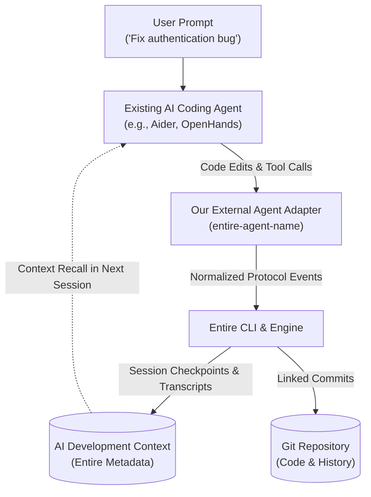

# 00 - Project Overview

> [!NOTE]
> **Project Working Name:** ContextForge (or `entire-agent-<target>`)
> **Tagline:** *Persistent memory for AI coding agents, powered by Entire.*
> **Core Concept:** "Git stores the code. Entire preserves the story behind the code."

---

## 1. Executive Summary

During the Buildathon conversation, the team explored how to participate in the hackathon challenge titled **"Bring Entire to a New Agent or Workflow"**.

Modern AI coding agents (such as Aider, OpenHands, Devin, Roo Code, Cursor, and Claude Code) generate code changes, run terminal commands, inspect files, and make design decisions. However, traditional Git only tracks the final file diffs, commit messages, and branch pointers. It loses the rich AI development context: **user prompts, agent reasoning, intermediate exploration, tool calls, and debugging attempts**.

[[02 - What Is Entire|Entire]] solves this by capturing agent development context into dedicated checkpoints associated with Git history. Our mission in this hackathon is to **bridge an unsupported AI coding agent to Entire**, enabling Entire to capture and recall rich development context for that agent.

---

## 2. Core Problem & Solution

### The Problem
* When coding agents work, **Git remembers**: commits, branches, line diffs.
* **Git does NOT remember**:
  * The prompt given by the developer.
  * The agent's thought process and reasoning.
  * Which files the agent inspected before editing.
  * The tools and terminal commands executed.
  * Failed intermediate attempts and fixes.
* On "Day 2", when a developer starts a new session, the agent has zero memory of previous decisions, forcing the developer to manually dump large context blocks.

### The Solution
* We build an **external agent adapter** inside the official `entireio/external-agents` repository.
* The adapter intercepts the target agent's lifecycle events and normalizes them into Entire's external agent protocol.
* Entire handles checkpointing, transcript storage, commit attribution, and rewind/explain capabilities (`entire explain`).

---

## 3. Knowledge Base Structure & Roadmap

This Obsidian vault structure represents the extracted technical architecture, decisions, and execution roadmap:

1. [[01 - Hackathon Challenge]] — Scope, rules, and track analysis.
2. [[02 - What Is Entire]] — Core mechanics of Entire and its checkpoint model.
3. [[03 - What We Have To Build]] — Clear demarcation: Entire capabilities vs our adapter.
4. [[04 - Architecture]] — End-to-end system design and data flow.
5. [[05 - Context vs Git]] — Semantic reasoning vs line diffs.
6. [[06 - External Agent Integration]] — Adapting external agents via Entire protocol.
7. [[07 - Repository Structure]] — Monorepo layout in `entireio/external-agents`.
8. [[08 - Development Workflow]] — Phased engineering plan and Git branching.
9. [[09 - Team Responsibilities]] — 3-person role split with zero code conflicts.
10. [[10 - MVP]] — Single-session capture + multi-session context recall.
11. [[11 - Demo Flow]] — Compelling before/after hackathon demo script.
12. [[12 - Open Questions]] — Unverified technical questions and action items.
13. [[13 - Technical Research]] — Candidate agent comparison and research findings.
14. [[14 - Roo Code Adapter Specification]] — Detailed Roo Code adapter implementation & protocol mapping.
15. [[Buildathon — What We Actually Need To Do]] — Concrete step-by-step execution guide.

---

## 4. Synthesis: Fact vs Decision vs Assumption

### Confirmed Facts
* The hackathon topic is **"Bring Entire to a New Agent or Workflow"**.
* Entire already maintains a dedicated repository: `entireio/external-agents` containing standalone Go binaries for agents like `amp`, `goose`, `grok`, `kilo`, `kiro`, `omp`, `qwen`.
* Our implementation must live inside the official `entireio/external-agents` repo/fork, not as a disconnected standalone project.
* A thin shell wrapper calling `entire` CLI is insufficient; the adapter must capture session transcripts, hooks, tool calls, and checkpoints.

### Decisions Made
* **No Custom Web App**: We will not waste time building a React/Vue frontend or a separate web dashboard; the core value is CLI/protocol integration.
* **No New AI Agent**: We will not build a new LLM agent from scratch; we adapt an existing, proven coding agent.
* **Architecture Alignment**: Adopt Entire's existing Go + `mise` architecture under `agents/entire-agent-<name>/`.
* **Team Structure**: Split work among 3 members: (1) Adapter/Hooks Lead, (2) Protocol/Context/Tests Lead, (3) Product/Docs/Demo Lead.

### Assumptions
* The target agent exposes observable events, logs, hooks, or stdout/IPC streams suitable for interception.
* Entire CLI provides commands (e.g. `entire enable`, `entire explain`, `entire rewind`) that interface with external agent binaries.

### Things to Verify
* Which candidate agent (Aider vs OpenHands vs Roo Code) has the most robust event hooks.
* The exact IPC/stdio schema expected by Entire's `internal/protocol/` package.
