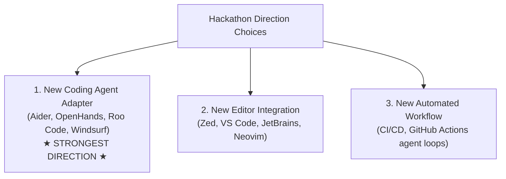
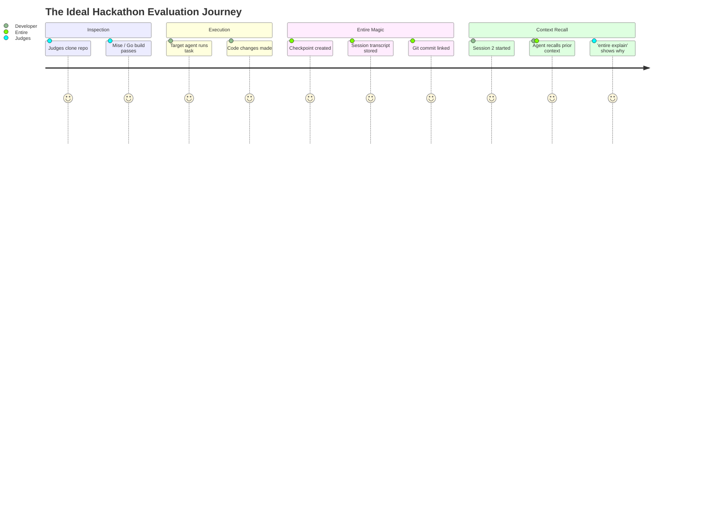

# 01 - Hackathon Challenge

> [!IMPORTANT]
> **Hackathon Theme:** "Bring Entire to a New Agent or Workflow"
> **Core Requirement:** Build an integration/adapter for an AI coding environment that Entire does not natively or externally support yet, enabling Entire to meaningfully capture and utilize its development context.

---

## 1. Challenge Breakdown

The challenge tests the ability to extend Entire's context-aware development ecosystem to new AI tools and development pipelines.

### Evaluation & Submission Criteria
1. **Meaningful Context Capture**:
   - A thin wrapper that merely executes `entire <command>` without capturing rich context is **explicitly disqualified / rejected**.
   - The solution must capture:
     - User prompts and intent.
     - Agent responses and intermediate reasoning.
     - Inspected files and modified files.
     - Executed tool calls and CLI commands.
     - Session start, checkpoint transitions, and session end.
2. **Repository Placement**:
   - The integration must reside inside a fork of the official `entireio/external-agents` repository.
   - It must follow repository standards (Go, `mise.toml`, `AGENT.md`, `README.md`, test suites).
3. **End-to-End Functionality**:
   - Must demonstrate session capture, Git checkpoint linking, and context inspection/recovery (`entire explain`, rewind/resume).

---

## 2. Potential Project Directions

During the initial strategy session, three major technical directions were evaluated:

### Option 1: New Coding Agent Adapter (Selected Direction)
* **Description**: Create a standalone agent adapter binary (`entire-agent-<name>`) for an unsupported AI coding tool (e.g. Aider, OpenHands, Roo Code).
* **Rationale**: Fits cleanly into `entireio/external-agents`. Direct parallel with existing binaries (`entire-agent-amp`, `entire-agent-goose`, etc.). Highest probability of completion within hackathon time limits.

### Option 2: New Editor Integration
* **Description**: Integrate Entire into an editor environment (e.g. Zed extension, Neovim plugin, VS Code extension).
* **Analysis**: Zed and Cursor already have partial hook mechanisms. Building a full editor plugin in Go/Rust/TypeScript simultaneously can increase scope risk.

### Option 3: New Workflow / CI Integration
* **Description**: Hook Entire into headless CI agent lifecycles (GitHub Actions: Issue $\rightarrow$ Agent $\rightarrow$ PR $\rightarrow$ Review $\rightarrow$ Fix $\rightarrow$ Merge).
* **Analysis**: Very interesting conceptually, but requires complex remote infrastructure and multiple moving parts during a live demo.

---

## 3. What Constitutes a Winning Hackathon Submission?

Judges want to see a clear **"Before vs. After"** demonstration:
* **Before (Without our adapter)**: Agent operates in a silo; context is lost upon session termination; Git commit has no record of agent reasoning or prompts.
* **After (With our adapter)**: Entire captures everything seamlessly into checkpoints. In subsequent sessions, the agent continues intelligently without manual prompt restatement.

---

## 4. Fact vs Decision vs Assumption

### Confirmed Facts
* The submission must be based in the `entireio/external-agents` repository layout.
* Shell wrappers without deep event translation are not acceptable.
* Entire already provides native hook integrations for tools like Claude Code, Cursor, Copilot CLI, Gemini CLI, and OpenCode, plus external agent binaries for Amp, Goose, Grok, Kilo, Kiro, Omp, and Qwen.

### Decisions Made
* Focus solely on **Option 1 (New Coding Agent Adapter)** to maximize reliability and feature depth.
* Reject the idea of creating a custom web UI, which would divert focus from core protocol and context mechanics.

### Assumptions
* The hackathon judges will evaluate code quality, protocol conformance, automated tests, and a reproducible demo script.

### Things to Verify
* The exact list of prohibited/already-supported agents in the latest `main` branch of `entireio/external-agents`.

---

## Related Notes
* [[00 - Project Overview]] — High-level summary and vision.
* [[02 - What Is Entire]] — Understanding the core Entire engine.
* [[03 - What We Have To Build]] — The exact adapter boundaries.
* [[06 - External Agent Integration]] — Deep dive into external agents.
* [[Buildathon — What We Actually Need To Do]] — Concrete execution checklist.
