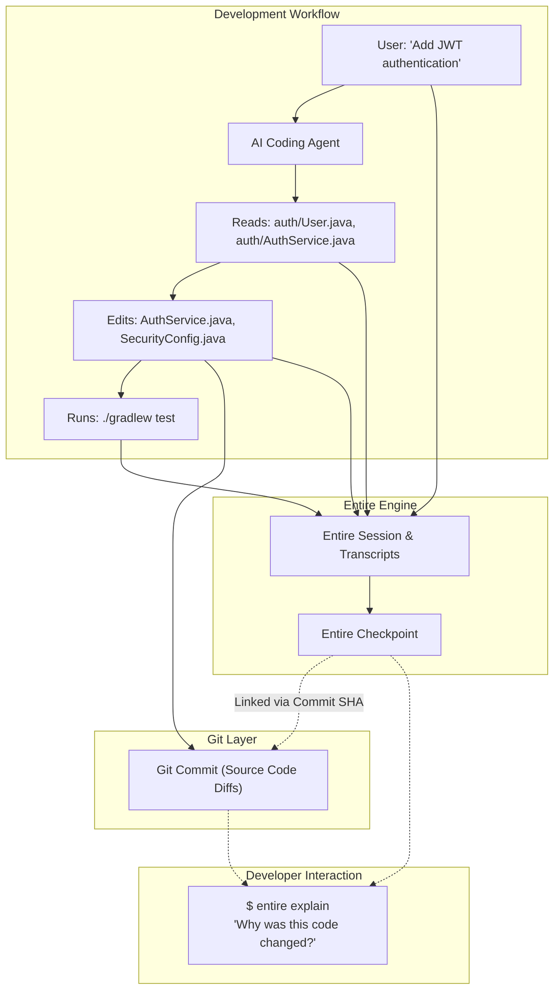
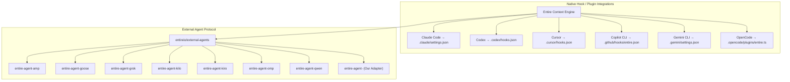

# 02 - What Is Entire

> [!NOTE]
> **Core Definition:** Entire is **Git for AI-agent work context**. It captures and structures the reasoning, transcripts, tool calls, and lifecycle events of AI coding agents, connecting this rich metadata directly to Git version control.

---

## 1. What Entire Solves

When human developers or AI agents use traditional Git, Git records:
* File modifications and diffs.
* Commit author, date, and commit messages.
* Branch references and merge trees.

However, when an AI coding agent performs work, **crucial contextual information is lost**:

| Lost in Traditional Git | Preserved by Entire |
| :--- | :--- |
| Initial developer prompt | Complete original user intent |
| Step-by-step LLM reasoning | Turn-by-turn thought traces |
| Inspected files not edited | Knowledge acquisition context |
| Tool calls and terminal commands | Executed commands and outputs |
| Intermediate failed attempts | Debugging journey and resolutions |
| Token accounting and attribution | Model/cost tracking per commit |

Entire captures this context into **Checkpoints** and **Session Transcripts**, storing session metadata safely without polluting the main codebase branch.

---

## 2. Core Entire Concepts & Terminology

### 1. Sessions & Turns
* **Session**: A complete interaction envelope starting when the agent launches and ending when the agent exits or task completes.
* **Turn**: A single prompt-response cycle containing tool invocations and intermediate outputs.

### 2. Transcripts
* Full chronological records of conversation history, user prompts, agent reasoning tokens, tool inputs, and tool outputs.

### 3. Checkpoints
* Snapshots of agent state, working tree state, and session metadata taken at key milestones (e.g. before/after major file edits or commits).

### 4. Semantic Attribution
* Directly attributing which agent model, prompt, and tool actions resulted in specific code changes.

### 5. Explain & Rewind (`entire explain`, `entire rewind`)
* `entire explain`: Allows developers to query why a piece of code was changed, retrieving the exact prompt and LLM reasoning that produced it.
* `entire rewind`: Enables resetting the codebase and agent state to a previous checkpoint.

---

## 3. How Entire Integrates with Agents

Entire supports agents through two primary mechanisms:

1. **Native Hooks/Plugins**: Built directly into agents that provide extensible configuration files (JSON settings or plugin hooks).
2. **External Agent Binaries**: Standalone Go binaries that teach the Entire CLI how to communicate with external tools that lack native Entire hook configurations.

---

## 4. Fact vs Decision vs Assumption

### Confirmed Facts
* Entire is built around a session/turn/checkpoint lifecycle model.
* `entire explain` queries stored session metadata linked to Git commits.
* Entire has two official repositories relevant to our challenge: `entireio/cli` and `entireio/external-agents`.

### Decisions Made
* We do not re-implement Entire's core checkpoint, Git ref storage, or rewind algorithms. We rely 100% on Entire CLI's protocol.

### Assumptions
* Checkpoint metadata is stored in hidden Git refs or isolated metadata branches, keeping developer work trees clean.

### Things to Verify
* The exact CLI commands supported by `entireio/cli` (e.g. `entire status`, `entire checkpoint`, `entire list`, `entire explain`).

---

## Related Notes
* [[00 - Project Overview]] — High-level summary.
* [[03 - What We Have To Build]] — Boundaries between Entire and our code.
* [[05 - Context vs Git]] — Semantic reasoning vs line diffs.
* [[06 - External Agent Integration]] — Deep dive into the external agent protocol.
