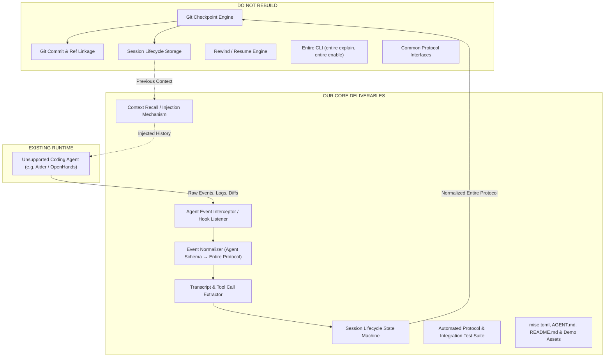

# 03 - What We Have To Build

> [!IMPORTANT]
> **Architectural Clarity:** The success of this project depends entirely on understanding the system boundaries. We are **NOT** building a new AI agent, a new Git backend, or a web dashboard. We are building a **protocol adapter/translator** for an unsupported AI coding agent inside `entireio/external-agents`.

---

## 1. Clear Division of Boundaries



---

## 2. Comparison Matrix: Built vs Provided

| System Component | Provided by Entire | Built by Our Team |
| :--- | :---: | :---: |
| **Git Ref / Checkpoint Storage Engine** | ✅ Yes | ❌ No |
| **Entire CLI Binary (`entire`)** | ✅ Yes | ❌ No |
| **Common External Agent Protocol Spec** | ✅ Yes | ❌ No |
| **Commit Linkage & Semantic Attribution** | ✅ Yes | ❌ No |
| **Agent-Specific Hook / CLI Listener** | ❌ No | ✅ **YES** |
| **Agent Event Normalization (`internal/<agent>`)** | ❌ No | ✅ **YES** |
| **Transcript & Tool Call Parser** | ❌ No | ✅ **YES** |
| **Context Extraction & Prompt Injection** | ❌ No | ✅ **YES** |
| **Package / Task Config (`mise.toml`, `go.mod`)** | ❌ No | ✅ **YES** |
| **End-to-End Test Suite & Demo Repo** | ❌ No | ✅ **YES** |

---

## 3. Anti-Patterns & Misconceptions to Avoid

During the design discussions, several common hackathon traps were identified and explicitly rejected:

### ❌ Anti-Pattern 1: Building a Separate Standalone Project
* *Trap:* Building a decoupled standalone application (e.g. `ContextForge/src/...`) with duplicated Git and storage engines.
* *Correction:* Our adapter must reside in `entireio/external-agents/agents/entire-agent-<name>` and compile into a standalone binary compliant with the repo's structure.

### ❌ Anti-Pattern 2: Building a Web Application / Dashboard
* *Trap:* Spending critical hours on React/Next.js frontend dashboards.
* *Correction:* Entire is a CLI and Git-native developer tool. A CLI workflow with rich context recovery and `entire explain` is significantly more impactful for judges.

### ❌ Anti-Pattern 3: Building a New AI Model or Coding Agent
* *Trap:* Trying to train or build a prompt-engineering coding agent from scratch.
* *Correction:* Leverage an existing, capable agent (e.g., Aider, OpenHands) and focus 100% on capturing its rich interaction context.

---

## 4. What We Need to Implement in `entireio/external-agents`

Our deliverables inside `agents/entire-agent-<name>/`:

```
agents/entire-agent-<name>/
├── cmd/
│   └── entire-agent-<name>/
│       └── main.go              # Entrypoint binary that Entire CLI executes
├── internal/
│   ├── <name>/
│   │   ├── agent.go             # Lifecycle state machine & hook manager
│   │   ├── hooks.go             # Interceptors for prompt, tool calls, and diffs
│   │   ├── transcript.go        # Transcript parsing and formatting
│   │   └── types.go             # Internal data models
│   └── protocol/
│       ├── protocol.go          # Entire external agent protocol encoder/decoder
│       └── types.go             # Entire standard event schemas
├── tests/
│   ├── unit/                    # Unit tests for parser and normalizer
│   └── integration/             # E2E test runs with the agent
├── AGENT.md                     # Agent capabilities & integration metadata
├── README.md                    # Setup, usage, and demo instructions
├── go.mod                       # Go module definition
└── mise.toml                    # Mise task runner config (build, test, lint)
```

---

## 5. Fact vs Decision vs Assumption

### Confirmed Facts
* The external agents repo contains independent sub-packages under `agents/`.
* Entire CLI invokes these external agent binaries to manage sessions and capture events.
* New agent integrations must include a `mise.toml` to integrate into the repo's automated CI/CD pipeline.

### Decisions Made
* Implement our adapter in **Go** to align perfectly with the rest of `entireio/external-agents`.
* Isolate all agent-specific translation logic in `internal/<name>/` and all Entire protocol communication in `internal/protocol/`.

### Assumptions
* The target agent provides predictable event signals (e.g. file watchers, pre/post command hooks, or JSON transcript files).

### Things to Verify
* What Go version and shared dependencies are required across `entireio/external-agents`.

---

## Related Notes
* [[02 - What Is Entire]] — Core mechanics of Entire.
* [[04 - Architecture]] — Detailed component interactions.
* [[06 - External Agent Integration]] — External agent protocol specifics.
* [[07 - Repository Structure]] — Monorepo file tree and layout.
* [[Buildathon — What We Actually Need To Do]] — Concrete execution checklist.
