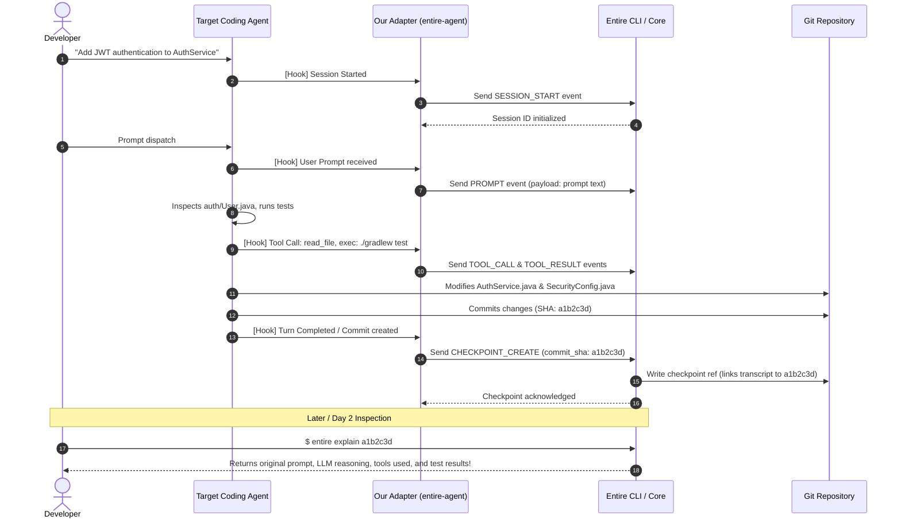
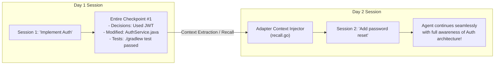

# 04 - Architecture

> [!NOTE]
> **Core Architectural Flow:**
> `Existing AI Coding Agent` $\rightarrow$ `Our External Agent Adapter` $\rightarrow$ `Entire CLI / Protocol` $\rightarrow$ `Git + AI Context`

---

## 1. System Architecture Overview

The system bridges an unsupported AI coding agent with the Entire development context platform by introducing a lightweight, non-intrusive **Adapter Layer**.

```mermaid
graph TD
    subgraph Agent Runtime Layer
        User["Developer / User"] -->|1. Prompt / Instructions| TargetAgent["Unsupported AI Agent\n(e.g., Aider, OpenHands)"]
        TargetAgent -->|2. Reads Files / Explores| Workspace[("Target Codebase\nWorkspace")]
        TargetAgent -->|3. Runs Tools & Edits Code| Workspace
    end

    subgraph Adapter Layer [Our Implementation]
        TargetAgent -.->|4. Raw Events / Hooks / Transcripts| Interceptor["Agent Event Interceptor\n(hooks.go)"]
        Interceptor --> Normalizer["Event Normalizer\n(agent.go)"]
        Normalizer --> TranscriptParser["Transcript & Tool Parser\n(transcript.go)"]
        TranscriptParser --> ProtocolClient["Entire Protocol Client\n(protocol.go)"]
    end

    subgraph Entire Core Engine
        ProtocolClient -->|5. Protocol Messages\n(Session, Turn, Tool, Checkpoint)| EntireCLI["Entire CLI / Core Engine"]
        EntireCLI --> SessionManager["Session & Turn Manager"]
        EntireCLI --> CheckpointEngine["Checkpoint Engine"]
        EntireCLI --> AttributionEngine["Semantic Attribution Engine"]
    end

    subgraph Persistent Storage Layer
        CheckpointEngine -->|6a. Checkpoint Objects & Transcripts| EntireRefs[("Entire Metadata Storage\n(refs/entire/sessions/*)")]
        CheckpointEngine -->|6b. Associates Commit SHA| GitStore[("Git Version Control\n(Commits, Trees, Diffs)")]
    end
```

---

## 2. Component Responsibility Breakdown

### 1. The Existing AI Coding Agent
* **What it does**: Receives natural language prompts from the developer, reasons about the codebase, calls tools (search, read file, run tests), and generates code edits.
* **What it produces**: Text responses, tool call traces, modified files on disk.
* **Limitation**: Does not natively structure its output for Entire or persist cross-session context linked to Git commits.

### 2. Our External Agent Adapter (`entire-agent-<name>`)
* **What it does**: Acts as the translation bridge. It observes the agent's runtime lifecycle, intercepts events, and serializes them into Entire's external agent protocol.
* **Key Tasks**:
  * Emits `SESSION_START` when the agent initializes.
  * Captures `USER_PROMPT` inputs.
  * Captures `TOOL_CALL` and `TOOL_OUTPUT` events (commands run, files inspected).
  * Captures `AGENT_RESPONSE` messages and intermediate reasoning.
  * Triggers `CHECKPOINT_CREATE` upon significant code changes or Git commits.
  * Emits `SESSION_END` on exit.

### 3. Entire CLI & Engine
* **What it provides**: The underlying context infrastructure.
* **Key Tasks**:
  * Manages session IDs, turn IDs, and checkpoint IDs.
  * Stores transcripts and session metadata in isolated Git refs (avoiding working tree pollution).
  * Links Git commit SHAs directly to session checkpoints.
  * Provides query commands like `entire explain` and `entire rewind`.

### 4. Git Layer
* **What it provides**: Immutable version control for source files (commits, branches, file trees, diffs).
* **Collaboration with Entire**: Git preserves the **code snapshot**, while Entire preserves the **reasoning, prompt history, and execution context** that led to that snapshot.

---

## 3. End-to-End Execution Sequence



---

## 4. Multi-Session Context Recovery Architecture

A critical value-add demonstrated in the conversation is enabling the agent to **remember previous sessions** without manual context dumps.



---

## 5. Fact vs Decision vs Assumption

### Confirmed Facts
* The adapter acts as a standalone translator binary communicating via Entire's external protocol.
* Entire handles linking Git commits to checkpoint metadata.
* `entire explain` inspects checkpoints associated with commit SHAs.

### Decisions Made
* Keep the adapter stateless where possible, relying on Entire for session state storage.
* Structure the adapter into clean packages: `cmd/` (CLI entry), `internal/<agent>/` (hook logic), and `internal/protocol/` (Entire wire communication).

### Assumptions
* The target agent provides reliable lifecycle hooks or stdout streaming that can be intercepted in real-time.

### Things to Verify
* Whether context injection back into the agent is done via prompt prefixing, CLI flags, or pre-session configuration files.

---

## Related Notes
* [[02 - What Is Entire]] — Core Entire concepts.
* [[03 - What We Have To Build]] — Boundaries and deliverables.
* [[05 - Context vs Git]] — Semantic reasoning vs Git diffs.
* [[06 - External Agent Integration]] — Protocol specification.
* [[07 - Repository Structure]] — Monorepo layout.
