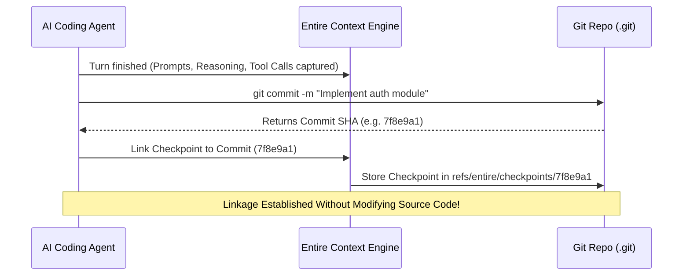

# 05 - Context vs Git

> [!NOTE]
> **Core Principle:** "Git stores the code. Entire preserves the story behind the code."
> Code tells you **WHAT** changed; Context tells you **WHY** and **HOW** it changed.

---

## 1. The Fundamental Context Gap in Modern Development

In traditional software development, Git was designed around human workflows: small diffs, manual commits, and human-written commit messages.

When AI agents write code, the development dynamic fundamentally changes:
1. **High Volume of Operations**: Agents explore dozens of files, run diagnostic scripts, discard multiple attempts, and edit multiple files in seconds.
2. **Loss of Intermediate Reasoning**: Only the final staged edits survive into the Git commit. The entire thought process, alternatives considered, and bug investigations vanish.
3. **The "Day 2" Amnesia**: In the next session or when another team member (or agent) takes over, all conversational context is gone. The developer must re-explain the entire context from scratch.

```mermaid
graph TD
    subgraph Traditional Git (What Changed)
        Commit["Git Commit (SHA: a1b2c3d)"]
        Commit --> Diffs["File Diffs: +24 lines, -8 lines"]
        Commit --> Msg["Commit Msg: 'Fixed token verification'"]
        Commit --> Tree["File Tree & Branch Pointers"]
    end

    subgraph Entire Context Layer (Why & How It Changed)
        CP["Entire Checkpoint (Linked to SHA: a1b2c3d)"]
        CP --> Prompt["Prompt: 'JWT signature check fails with RS256 keys'"]
        CP --> Reasoning["LLM Reasoning: Key formatting required PEM decoding"]
        CP --> Inspected["Files Inspected: config/keys.go, auth/jwt.go"]
        CP --> ToolCalls["Tools Run: go test ./auth/... (failed first, passed on fix)"]
        CP --> Session["Session ID & Turn History"]
    end

    Commit -.->|Bi-directional Link| CP
```

---

## 2. Granular Comparison: Git vs Entire

| Dimension | Traditional Git | Entire Context Engine |
| :--- | :--- | :--- |
| **Primary Artifact** | Tree snapshots and line-level diffs | Checkpoints, Transcripts, and Event streams |
| **Unit of Record** | Commit | Turn / Session / Checkpoint |
| **Intent Tracking** | Short commit message (often brief or generated) | Original developer prompts and instruction chain |
| **Exploration Tracking** | None (only files with diffs are recorded) | Full list of inspected/read files |
| **Tool / Command Trace**| None | Exact shell commands, outputs, and exit codes |
| **Debugging History** | None (failed attempts are overwritten) | Complete intermediate turn logs and error corrections |
| **Storage Location** | Standard Git object database (`.git/objects`) | Isolated Git metadata refs (`refs/entire/...`) |
| **Query Command** | `git log`, `git diff`, `git blame` | `entire explain <sha>`, `entire list`, `entire rewind` |

---

## 3. How Context Is Associated with Git History

Entire does not replace Git; it **augments Git via metadata linkage**:



1. **Deterministic Commit Association**: When a commit occurs, Entire generates a checkpoint containing all session turns up to that commit and links it to the commit hash.
2. **Clean Working Tree**: Checkpoint metadata is stored in dedicated Git references (e.g., `refs/entire/...`), keeping developer branches completely clean of JSON artifacts or metadata noise.
3. **Traceability**: Running `entire explain <commit-sha>` retrieves the exact turn history and rationale behind the changes in that commit.

---

## 4. Solving the "Day 2" Problem: Context Recall

### Before (Without Entire)
```
Developer: "Continue authentication work."
Agent:     "I don't know what you did before. Please provide the files, previous decisions, and architecture."
Developer: [Spends 10 minutes copying and pasting past context]
```

### After (With Entire Context Recall)
```
Developer: "Continue authentication work."
Adapter:   [Automatically queries Entire checkpoints for latest auth session context]
Agent:     "Retrieved previous session context:
            - Previous task: Implemented JWT token verification in auth/jwt.go
            - Tests run: go test ./auth/... (all passing)
            - Next planned step: Add password reset token endpoint.
            Proceeding with password reset implementation..."
```

---

## 5. Fact vs Decision vs Assumption

### Confirmed Facts
* Git alone cannot reconstruct why an AI agent made specific code edits.
* Entire associates session context with Git commit SHAs using separate Git metadata storage.
* `entire explain` provides immediate semantic context for any checkpointed commit.

### Decisions Made
* Emphasize the **"Why vs What"** narrative in all project documentation, presentation slides, and demo scripts.
* Focus our adapter implementation on extracting structured turns (prompts, tool calls, file reads) rather than just raw unstructured text dumps.

### Assumptions
* Git commits can be triggered either by the agent or by the user, and Entire can link checkpoints in both cases.

### Things to Verify
* The exact data structure of an Entire checkpoint ref in Git.

---

## Related Notes
* [[02 - What Is Entire]] — Core Entire concepts.
* [[04 - Architecture]] — End-to-end data flow.
* [[10 - MVP]] — Single-session and multi-session deliverables.
* [[11 - Demo Flow]] — Demonstrating the "Day 1 vs Day 2" value to judges.
