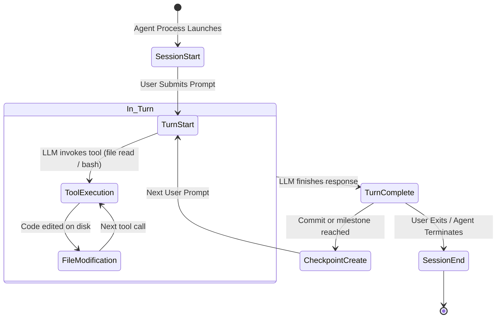

# 06 - External Agent Integration

> [!NOTE]
> **Repository:** `https://github.com/entireio/external-agents`
> **Purpose:** Standalone external agent binaries that teach Entire CLI how to work with AI coding agents that are not natively supported through in-editor JSON hook files.

---

## 1. How External Agents Work in Entire

When an AI coding agent lacks native settings hooks (like `.claude/settings.json` or `.cursor/hooks.json`), Entire uses the **External Agent Subsystem**.

In this architecture:
1. Each supported external agent is implemented as a standalone binary in Go inside `agents/entire-agent-<name>/`.
2. The binary implements a standardized **Entire External Agent Protocol**.
3. Entire CLI discovers, installs, and executes these binaries (e.g. via `entire enable <agent>`).
4. The adapter runs alongside or wraps the agent, capturing events and feeding normalized data back to Entire.

```mermaid
graph TD
    subgraph entireio/external-agents
        RepoRoot["entireio/external-agents/"]
        RepoRoot --> Agent1["agents/entire-agent-amp/"]
        RepoRoot --> Agent2["agents/entire-agent-goose/"]
        RepoRoot --> Agent3["agents/entire-agent-grok/"]
        RepoRoot --> Agent4["agents/entire-agent-kilo/"]
        RepoRoot --> Agent5["agents/entire-agent-kiro/"]
        RepoRoot --> Agent6["agents/entire-agent-omp/"]
        RepoRoot --> Agent7["agents/entire-agent-qwen/"]
        RepoRoot --> OurAgent["agents/entire-agent-<NEW>/ (OUR PROJECT)"]
    end

    OurAgent --> Binary["Compiles to: entire-agent-<name> binary"]
    Binary <-->|External Agent Protocol (IPC/stdio)| EntireCLI["Entire CLI"]
```

---

## 2. Existing Precedents & Integration Patterns

From our code and repository analysis, existing adapters exhibit clear functional precedents:

1. **Zed Agent Precedent**:
   * Captures session and turn lifecycles.
   * Extracts conversational transcripts and user prompts.
   * Maps editor buffer changes to turn events.
2. **Devin Precedent**:
   * Manages granular checkpointing.
   * Handles semantic attribution of generated code diffs.
   * Performs deep transcript analysis and token accounting.
3. **Goose / Amp / Qwen Adapters**:
   * Provide CLI lifecycle wrappers.
   * Read hook events or log files emitted during LLM tool invocations.

---

## 3. The External Agent Lifecycle Protocol

The standard Entire external agent protocol defines key lifecycle hooks that our adapter must handle:



### Protocol Events & Payloads

| Lifecycle Event | When Triggered | Metadata Captured |
| :--- | :--- | :--- |
| `SESSION_START` | Agent process initializes | Agent name, version, working directory, git branch, timestamp |
| `PROMPT_RECEIVED`| User submits a query/task | Raw prompt text, user metadata, turn ID |
| `TOOL_START` | Agent triggers a tool/command | Tool name (e.g. `read_file`, `bash_exec`), arguments |
| `TOOL_FINISH` | Tool finishes execution | Exit code, stdout/stderr snippet, duration |
| `FILES_CHANGED` | Agent writes or modifies files| File paths, line counts, staged status |
| `CHECKPOINT` | Commit staged or turn finished | Linked Git commit SHA, turn summary, checkpoint ID |
| `SESSION_END` | Agent exits or disconnects | Final status, total turns, session summary |

---

## 4. Evaluation of Candidate Target Agents

To pick the strongest hackathon target, we evaluated several unsupported coding agents:

| Candidate Agent | Interface Type | Hook / Event Feasibility | Community Popularity | Hackathon Recommendation |
| :--- | :--- | :--- | :--- | :--- |
| **Aider** | CLI (Python) | High (Git-native, event logs, formatted markdown output, scriptable) | Very High | **Top Candidate (Recommended)** |
| **OpenHands** | Web / CLI (Python) | High (Event stream architecture, Action/Observation JSON protocol) | Very High | **Strong Candidate** |
| **Roo Code** | VS Code Extension | Medium (Task history stored in JSON, needs VS Code bridge) | High | Viable Alternative |
| **Windsurf** | Proprietary IDE | Low (Closed source plugin layer, difficult to hook reliably) | High | Not Recommended |

---

## 5. Fact vs Decision vs Assumption

### Confirmed Facts
* `entireio/external-agents` is an active monorepo containing multiple external agent adapters written in Go.
* Agents like `amp`, `goose`, `grok`, `kilo`, `kiro`, `omp`, and `qwen` already exist in the repo and **must not be duplicated**.
* Adapters communicate with Entire via standard protocol messages.

### Decisions Made
* Follow the standard directory and module pattern established by existing adapters in `agents/`.
* Focus on an unsupported agent with easily accessible event streams (e.g., Aider or OpenHands).

### Assumptions
* The target agent's events can be intercepted either via process wrapping (stdio pipe) or filesystem log watching.

### Things to Verify
* The exact wire format (JSON-RPC, JSON over stdio, or REST/socket) used by `internal/protocol/`.

---

## Related Notes
* [[02 - What Is Entire]] — Core Entire concepts.
* [[03 - What We Have To Build]] — Deliverables and scope.
* [[07 - Repository Structure]] — File layout for the adapter.
* [[13 - Technical Research]] — In-depth target agent analysis.
