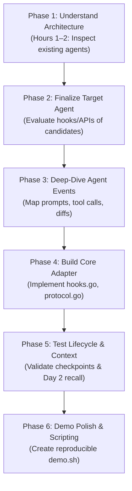
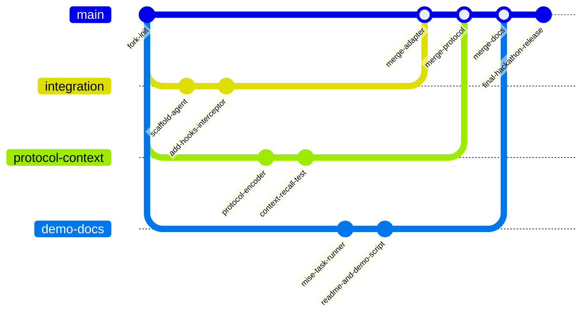

# 08 - Development Workflow

> [!NOTE]
> **Guiding Principle:** "Don't immediately start typing code. Align on the target agent, understand Entire's existing architecture, and build against a proven reference pattern."

---

## 1. Phased Development Roadmap

The hackathon execution is structured into 6 sequential phases designed to minimize rework and keep all teammates synchronized:



### Phase 1 — Architecture Inspection (Team-wide)
* Clone `entireio/external-agents`.
* Inspect existing implementations (`entire-agent-goose`, `entire-agent-amp`).
* Trace how standard events (`SESSION_START`, `PROMPT`, `TOOL_CALL`, `CHECKPOINT`) flow from agent to Entire.

### Phase 2 — Target Selection
* Select an unsupported agent (e.g. Aider) with accessible event interfaces.
* Validate that no other adapter in `agents/` already supports this agent.

### Phase 3 — Target Event Analysis
* Inspect how the target agent exposes:
  * User prompts (stdin, CLI flags, JSON RPC).
  * LLM responses (stdout stream, API callbacks).
  * Tool calls (executed commands, file inspection).
  * Code modifications (staged files, diff generation).
  * Session start and termination signals.

### Phase 4 — Adapter Implementation
* Scaffold `agents/entire-agent-<target>/`.
* Implement `hooks.go` to capture raw agent events.
* Implement `transcript.go` to parse and format turns.
* Implement `protocol.go` to serialize into Entire protocol payloads.

### Phase 5 — Testing & Verification
* Run unit tests for parsing and serialization.
* Run integration tests: verify that running the agent triggers Entire checkpoint creation.
* Validate context recall: verify that starting a second session retrieves previous checkpoint metadata.

### Phase 6 — Demo & Presentation Scripting
* Build a sample sandbox repository for the live demo.
* Create automated `setup.sh` and `demo.sh` scripts.
* Rehearse the live walkthrough.

---

## 2. Git Branching & Collaboration Strategy

To avoid merge conflicts, team members work on isolated feature branches mapped to their ownership domains:



### Branch Responsibilities
* `main`: Stable release branch containing reviewed code.
* `integration`: Person 1's branch for agent hooks, lifecycle management, and event capture.
* `protocol-context`: Person 2's branch for protocol encoding, checkpoint validation, and context extraction.
* `demo-docs`: Person 3's branch for `mise.toml`, `README.md`, test repositories, and demo scripts.

---

## 3. Standard Shell Workflow & Commands

```powershell
# 1. Clone your team's fork
git clone https://github.com/<team-fork>/external-agents.git
cd external-agents

# 2. Navigate to your agent directory
cd agents/entire-agent-<target>

# 3. Build the adapter binary
mise run build
# OR directly with Go:
go build -o bin/entire-agent-<target> ./cmd/entire-agent-<target>

# 4. Run tests
mise run test
# OR directly with Go:
go test -v ./...

# 5. Execute demo script
./scripts/demo.sh
```

---

## 4. Fact vs Decision vs Assumption

### Confirmed Facts
* The team consists of 3 engineers.
* All work must be merged into the fork's `main` branch before hackathon submission.

### Decisions Made
* Dedicate the first 1–2 hours to shared architecture analysis before writing any adapter code.
* Use feature branches and PR-based integration to prevent concurrent file conflicts.

### Assumptions
* All team members have Go and `mise` installed locally.

### Things to Verify
* Ensure all teammates can compile an existing agent (e.g. `entire-agent-goose`) locally before writing new code.

---

## Related Notes
* [[06 - External Agent Integration]] — External agent protocol.
* [[07 - Repository Structure]] — File layout.
* [[09 - Team Responsibilities]] — Team member role breakdown.
* [[10 - MVP]] — Milestone definitions.
