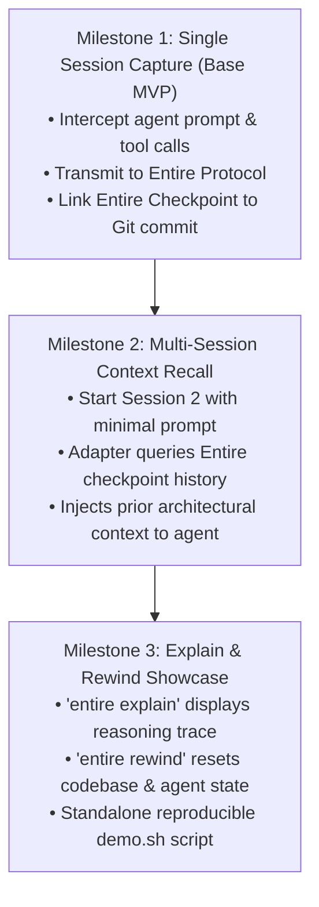
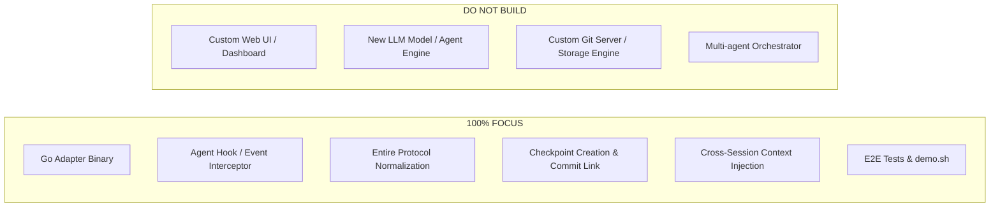

# 10 - MVP

> [!NOTE]
> **MVP North Star:** A functional, end-to-end integration demonstrating:
> 1. Real-time capture of an unsupported AI agent's session into Entire checkpoints.
> 2. Seamless continuation across sessions where the agent recalls prior decisions without manual context re-entry.

---

## 1. MVP Milestone Breakdown

---

## 2. Granular Milestone Deliverables

### Milestone 1: Single Session Capture (Base MVP)
* **Goal**: Prove that the unsupported agent can run a coding task and have its full context recorded in Entire.
* **Flow**:
  1. User starts agent via our adapter.
  2. User issues a coding task (e.g., "Add User authentication model").
  3. Agent explores repository, edits files, and runs tests.
  4. Adapter captures:
     - Prompts and system instructions.
     - Files inspected and modified.
     - Tool invocations and terminal command logs.
  5. Entire CLI receives events and writes a **Checkpoint** linked to the resulting Git commit.

### Milestone 2: Multi-Session Context Recall ("Agent Remembers")
* **Goal**: Prove that Entire's stored context provides persistent memory for the agent.
* **Flow**:
  1. User closes Session 1.
  2. User starts Session 2 with a brief prompt: `"Continue auth work. Add JWT token validation."`
  3. Adapter retrieves prior checkpoint metadata from Entire.
  4. Agent starts Session 2 with full knowledge of Session 1's decisions, file paths, and test outputs without the user re-pasting anything.

### Milestone 3: Inspection & Rewind Polish
* **Goal**: Provide the killer developer experience that wows hackathon judges.
* **Flow**:
  1. Run `entire explain <commit-sha>`: outputs the complete prompt, rationale, and tool traces for that commit.
  2. Run `entire rewind`: cleanly rolls back both the working tree and the agent's context to a prior checkpoint.

---

## 3. Strict MVP Scope Boundaries

---

## 4. MVP Acceptance Checklist

- [ ] Adapter builds cleanly via `mise run build` / `go build`.
- [ ] Agent process launches successfully through the adapter.
- [ ] Prompts and turn responses are captured in real-time.
- [ ] Tool calls (e.g. bash commands, file reads) are recorded.
- [ ] Entire Checkpoints are created and linked to Git commit SHAs.
- [ ] `entire explain` returns formatted context for the agent's commits.
- [ ] Session 2 successfully recalls decisions made in Session 1.
- [ ] Automated tests in `tests/` pass with zero failures.
- [ ] `scripts/demo.sh` runs the full lifecycle from scratch reliably.

---

## 5. Fact vs Decision vs Assumption

### Confirmed Facts
* The MVP must show both capture (Day 1) and value delivery (Day 2 context retrieval / explain).
* Entire handles the underlying checkpoint storage mechanics.

### Decisions Made
* Prioritize Milestone 1 & 2 before polishing Milestone 3.
* Keep the demo scenario concrete and familiar (Authentication module creation and extension).

### Assumptions
* The target agent's CLI supports pre-loading or injecting context during initialization.

### Things to Verify
* The exact command arguments for `entire explain` and `entire rewind` in `entireio/cli`.

---

## Related Notes
* [[03 - What We Have To Build]] — Deliverables definition.
* [[08 - Development Workflow]] — Phased roadmap.
* [[11 - Demo Flow]] — Detailed step-by-step presentation script.
* [[Buildathon — What We Actually Need To Do]] — Execution checklist.
