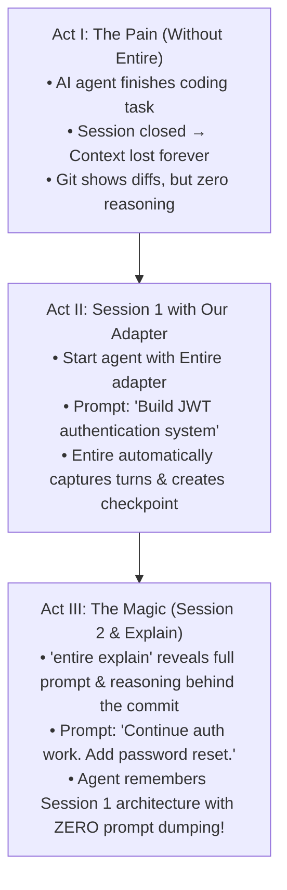

# 11 - Demo Flow

> [!TIP]
> **Pitch Strategy:** Hackathon judges evaluate on **clarity, reliability, and the "Before vs. After" impact**. A 3-minute, highly visual, terminal-based narrative showing real context preservation will score significantly higher than an unfinished UI dashboard.

---

## 1. Demo Narrative Arc: The 3-Act Structure



---

## 2. Step-by-Step Scripted Demo Walkthrough

### Act I: The Baseline Problem (30 Seconds)
* **Speaker:** *"When coding agents write code, Git records what lines changed. But when the session closes, the prompt, intermediate attempts, and architecture decisions vanish. On Day 2, you have to manually copy-paste everything back."*

---

### Act II: Session 1 — Capture & Checkpoint (60 Seconds)

1. **Launch Agent with Entire Integration**:
   ```bash
   $ entire enable <target-agent>
   $ entire-agent-<target> --session "auth-feature"
   ```

2. **Issue Task**:
   ```
   User > "Implement JWT-based authentication in auth/jwt.go and protect the /api/v1/profile endpoint."
   ```

3. **Agent Operates**:
   * Agent inspects `models/user.go`.
   * Agent writes `auth/jwt.go` and updates `server.go`.
   * Agent executes tests: `go test ./auth/...` (passes).
   * Agent commits: `git commit -m "feat(auth): implement JWT token verification"`.

4. **Entire Captures Checkpoint**:
   * The adapter transmits all turns, file inspections, and tool logs to Entire.
   * Entire creates a checkpoint linked to commit `a1b2c3d`.

---

### Act III: The Power of Entire & Seamless Continuation (90 Seconds)

1. **Inspection with `entire explain`**:
   ```bash
   $ entire explain HEAD
   ```
   * **Output Displayed**:
     ```yaml
     Checkpoint: cp_9842aef1
     Linked Commit: a1b2c3d (feat(auth): implement JWT token verification)
     Original Prompt: "Implement JWT-based authentication in auth/jwt.go..."
     LLM Model: claude-3-5-sonnet / gpt-4o
     Files Inspected: models/user.go, config/auth.json
     Files Modified: auth/jwt.go, server.go
     Tools Executed: go test ./auth/... (Exit Code: 0)
     Rationale: "Selected RS256 algorithm; generated signing keys in memory..."
     ```

2. **Session 2 Continuation (The "Agent Remembers" Moment)**:
   ```bash
   $ entire-agent-<target> --session "auth-feature"
   ```
   ```
   User > "Continue auth work. Add password reset token support."
   ```
   * **Agent Response**:
     ```
     [Entire Context Loaded]: Found prior checkpoint cp_9842aef1 (JWT Auth module).
     "I see we already implemented JWT token verification in auth/jwt.go using RS256. 
     I will now create a PasswordResetClaims struct and add the /api/v1/password-reset endpoint..."
     ```
   * **Judges' Reaction**: The agent continues instantly without needing the user to explain the existing JWT code!

3. **Rewind Showcase (Optional Polish)**:
   ```bash
   $ entire rewind cp_9842aef1
   # Reverts workspace and agent state cleanly to checkpoint
   ```

---

## 3. Demo Assets & Scripting (`scripts/demo.sh`)

An automated demo runner ensures deterministic execution without typos:

```bash
#!/usr/bin/env bash
set -e

echo "=== Step 1: Initializing Demo Environment ==="
./scripts/setup.sh

echo "=== Step 2: Running Session 1 (Feature Implementation) ==="
./bin/entire-agent-<target> --mock-run 1

echo "=== Step 3: Inspecting Entire Checkpoint ==="
entire explain HEAD

echo "=== Step 4: Running Session 2 (Context Recall Continuation) ==="
./bin/entire-agent-<target> --mock-run 2

echo "=== Demo Completed Successfully! ==="
```

---

## 4. Fact vs Decision vs Assumption

### Confirmed Facts
* A clear before-and-after story highlighting context loss vs context recall is the strongest presentation format for Entire.
* `entire explain` is the primary interactive command to showcase why code was written.

### Decisions Made
* Use an authentication feature scenario as the demo payload (relatable, clear code artifacts, testable).
* Build an automated `scripts/demo.sh` to prevent live demo glitches.

### Assumptions
* Demo will be conducted live via terminal and recorded as a backup video.

### Things to Verify
* Ensure all terminal formatting and ANSI colors render cleanly on recording devices and live projectors.

---

## Related Notes
* [[08 - Development Workflow]] — Development phases.
* [[09 - Team Responsibilities]] — Person 3's demo deliverables.
* [[10 - MVP]] — MVP acceptance criteria.
* [[Buildathon — What We Actually Need To Do]] — Execution steps.
