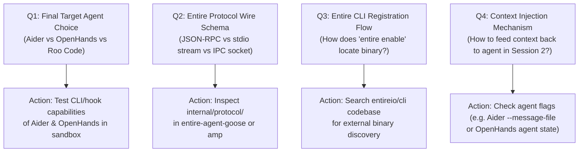

# 12 - Open Questions

> [!CAUTION]
> **Risk Management:** These are the unresolved technical questions and assumptions identified during the initial planning phase. They must be answered during Phase 1 & 2 before deep coding begins.

---

## 1. Technical Ambiguities & Resolution Plan

---

## 2. Detailed Breakdown of Open Questions

### Question 1: Which unsupported agent is the safest and highest-impact target?
* **Context**: We need an agent that Entire does not already support, is popular, and provides accessible event streams.
* **Candidates**:
  * *Aider*: Python CLI, Git-native, easy to wrap or hook via custom scripts / environment flags.
  * *OpenHands*: Full agent sandbox with JSON action/observation event streams, but heavier setup.
  * *Roo Code*: VS Code extension; requires bridging extension event logs to our Go binary.
* **Resolution Action**: In Hour 1, Person 1 and Person 2 will run a 15-minute spike testing Aider and OpenHands event extraction.

---

### Question 2: What is the exact wire protocol format in `internal/protocol/`?
* **Context**: Adapters must emit events formatted precisely as Entire expects.
* **Options**:
  * JSON Lines over `stdout` / `stdin`.
  * Unix Domain Socket / Named Pipe IPC.
  * gRPC or JSON-RPC.
* **Resolution Action**: Inspect `agents/entire-agent-goose/internal/protocol/` or `agents/entire-agent-amp/internal/protocol/` to extract the exact Go struct definitions and serialization logic.

---

### Question 3: How does Entire CLI discover and invoke external agent binaries?
* **Context**: When a user runs `entire enable <agent>` or when Entire runs the agent, where must the binary be located?
* **Assumptions**:
  * Placed in `$PATH` or in `~/.entire/bin/`.
  * Or configured via `~/.entire/config.yaml`.
* **Resolution Action**: Person 3 will inspect `entireio/cli` documentation or run `entire --help` / `entire agent list` to verify discovery rules.

---

### Question 4: How is recalled context injected back into the agent for Session 2?
* **Context**: When starting Session 2, we want the agent to automatically ingest prior checkpoint summaries.
* **Options**:
  * Passing a prepended system prompt via CLI argument (e.g. `--message` or `--system-prompt`).
  * Writing a temporary context file (e.g. `.contextforge_context.md`) read on agent startup.
  * Intercepting the first prompt before forwarding to LLM.
* **Resolution Action**: Person 2 will prototype prompt interception and test which injection method feels most seamless for the chosen agent.

---

### Question 5: Go Module and Monorepo Workspace Configuration
* **Context**: How are dependencies managed across `entireio/external-agents`?
* **Options**:
  * Monorepo uses Go 1.22+ `go.work` file.
  * Each subdirectory under `agents/` is an independent Go module with its own `go.mod`.
* **Resolution Action**: Check root `go.work` or `go.mod` in `entireio/external-agents`.

---

## 3. Fact vs Decision vs Assumption

### Confirmed Facts
* `entireio/external-agents` already has working examples that answer Q2, Q3, and Q5 directly.
* Aider is currently not in the list of existing agents in `agents/`.

### Decisions Made
* Allocate the first 90 minutes of the hackathon strictly to resolving these 5 questions before writing implementation code.

### Assumptions
* Aider is the current front-runner due to its lightweight CLI nature and Git-first workflow.

### Things to Verify
* Clone the repository and execute `grep` across `agents/` to confirm shared protocol utilities.

---

## Related Notes
* [[06 - External Agent Integration]] — Existing agent adapters.
* [[08 - Development Workflow]] — Phased development workflow.
* [[13 - Technical Research]] — Technical feasibility analysis.
* [[Buildathon — What We Actually Need To Do]] — Execution checklist.
