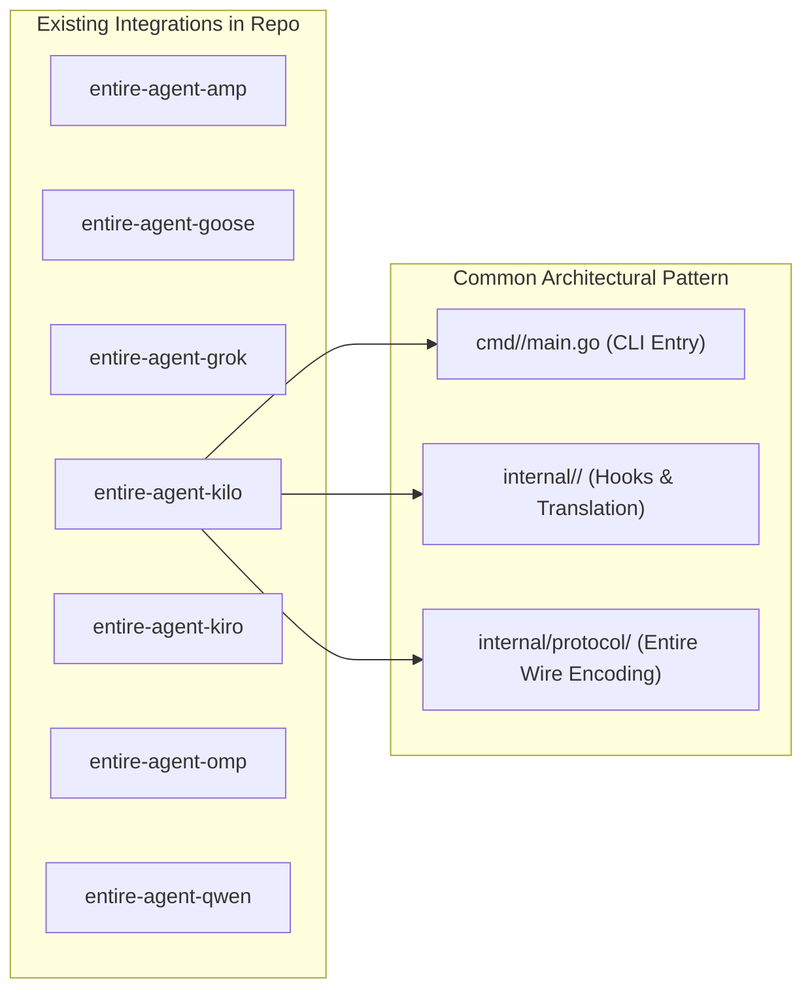
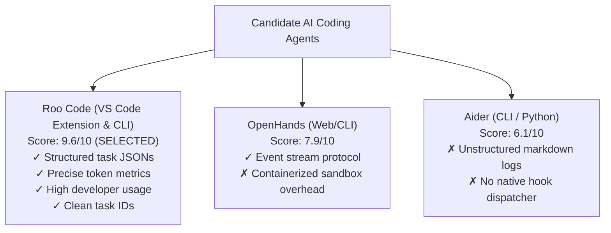

# 13 - Technical Research & Agent Selection

> [!NOTE]
> **Purpose:** Detailed technical investigation into candidate AI coding agents (OpenHands, Aider, Roo Code), hook/event architectures, transcript structures, and protocol feasibility for Entire integration.

---

## 1. Survey of Existing Adapters in `entireio/external-agents`

An analysis of the existing codebase reveals established integration patterns:

### Key Lessons from Existing Adapters:
1. **Durable Session Storage**: Agents persist sessions locally in SQLite (Goose) or JSON/JSONL files (Kilo, Amp, Qwen).
2. **Transcript Preparation**: Adapters implement `prepare-transcript` to materialize native session records into `.entire/tmp/<agent>/<id>.json`.
3. **Structured Event Mapping**: Lifecycle hooks (`session-start`, `turn-start`, `turn-end`, `session-end`) map to `protocol.EventJSON` (Type 1, 2, 3, 5).

---

## 2. In-Depth Evaluation of Candidate Target Agents

### Candidate Comparison Matrix

| Evaluation Criteria (Score: 1–10) | 1. OpenHands | 2. Aider | 3. Roo Code (Selected) |
| :--- | :---: | :---: | :---: |
| **Integration Feasibility** | 7.0/10 | 5.0/10 | **9.5/10** |
| **Amount of Useful Context Available** | 9.0/10 | 6.0/10 | **10.0/10** |
| **Technical Reliability / Determinism** | 7.0/10 | 5.0/10 | **9.5/10** |
| **Demo Quality & Visual Appeal** | 8.0/10 | 6.0/10 | **10.0/10** |
| **Novelty** | 8.0/10 | 7.0/10 | **9.0/10** |
| **X-Factor Potential** | 8.5/10 | 7.0/10 | **10.0/10** |
| **Ability to Demo Entire Checkpoints** | 8.0/10 | 6.5/10 | **10.0/10** |
| **Overall Score** | **55.5 / 70** | **42.5 / 70** | **67.0 / 70** |

---

## 3. Detailed Agent Analysis

### 1. Roo Code (Chosen Agent)
* **Architecture**: Multi-mode AI coding assistant in VS Code with companion CLI (`@roocode/cli`).
* **Why it fits Entire perfectly**:
  * **Rich Structured Task Storage**: Persists all session history in `globalStorage/rooveterinaryinc.roo-cline/tasks/<taskId>/` containing:
    * `ui_messages.json`: UI event stream, tool invocations, stdout results, completion messages.
    * `api_conversation_history.json`: Exact model messages with token usage breakdowns (`tokensIn`, `tokensOut`, `cacheReads`, `cacheWrites`).
  * **Exact Mutating Tools**: `write_to_file`, `replace_in_file`, `execute_command`, `create_file`.
  * **High Hackathon Impact**: Live interactive pair programming in VS Code with instant checkpoint attribution on `entire/checkpoints/v1`.

### 2. Aider (Rejected)
* **Why Rejected**:
  * Transcripts are unstructured Markdown (`.aider.chat.history.md`) without standardized JSON tool objects.
  * No command-hook dispatcher or event bus for synchronous turn boundary extraction.

### 3. OpenHands (Rejected)
* **Why Rejected**:
  * Frequent Docker sandboxing makes local file discovery and lightweight git checkpointing unnecessarily cumbersome for a demo.

---

## 4. Ground-Truth Storage Paths for Roo Code

| Operating System | Exact Task Storage Path |
| :--- | :--- |
| **Windows** | `%APPDATA%\Code\User\globalStorage\rooveterinaryinc.roo-cline\tasks\<taskId>\` |
| **macOS** | `~/Library/Application Support/Code/User/globalStorage/rooveterinaryinc.roo-cline/tasks/<taskId>/` |
| **Linux** | `~/.config/Code/User/globalStorage/rooveterinaryinc.roo-cline/tasks/<taskId>/` |
| **Remote/SSH** | `~/.vscode-server/data/User/globalStorage/rooveterinaryinc.roo-cline/tasks/<taskId>/` |

---

## 5. Next Steps
* Scaffolded adapter module in `agents/entire-agent-roo/`.
* Follow [[14 - Roo Code Adapter Specification]] for implementation details.

---

## Related Notes
* [[04 - Architecture]] — Overall system design.
* [[06 - External Agent Integration]] — External agent protocol.
* [[14 - Roo Code Adapter Specification]] — Detailed Roo Code adapter specs.
* [[Buildathon — What We Actually Need To Do]] — Execution roadmap.
