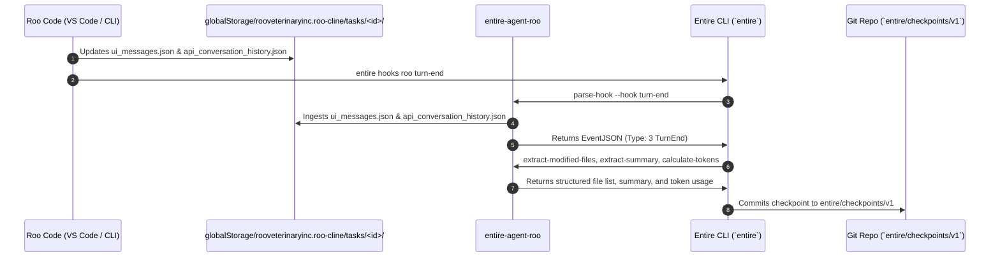

# 14 - Roo Code Adapter Specification

> [!NOTE]
> **Purpose:** Technical specification and architecture documentation for `entire-agent-roo`, the Entire external agent adapter for Roo Code.

---

## 1. System Architecture



---

## 2. Directory Structure in Repository

```
agents/entire-agent-roo/
├── AGENT.md                                 # Full agent spec & protocol mapping
├── README.md                                # Setup & subcommand reference
├── go.mod                                   # Go 1.26 module
├── mise.toml                                # Task runner configs (test, build)
├── cmd/
│   └── entire-agent-roo/
│       └── main.go                          # CLI dispatch entrypoint
└── internal/
    ├── protocol/                            # Entire Protocol v1 Layer
    │   ├── types.go                         # DeclaredCapabilities, EventJSON
    │   ├── protocol.go                      # Handlers & I/O
    │   └── handlers_test.go                 # Protocol handler unit tests
    └── roo/                                 # Roo Code Domain Logic
        ├── types.go                         # ClineMessage, ApiMessage, RooTaskEnvelope
        ├── paths.go                         # Task directory discovery & safe IDs
        ├── paths_test.go                    # Path resolution tests
        ├── agent.go                         # Info, Detect, Resume formatting
        ├── hooks.go                         # ParseHook & .roo/hooks.json installer
        ├── hooks_test.go                    # Hook parsing tests
        ├── transcript.go                    # Modified files, summary, tokens extraction
        └── transcript_test.go               # Transcript processing unit tests
```

---

## 3. Protocol Capabilities Declared

| Capability | Enabled | Description |
| :--- | :---: | :--- |
| `hooks` | `true` | Supports workspace-level hooks and external turn triggers |
| `transcript_analyzer` | `true` | Analyzes `ui_messages.json` and `api_conversation_history.json` |
| `transcript_preparer` | `true` | Materializes snapshots into `.entire/tmp/roo/<taskId>.json` |
| `token_calculator` | `true` | Calculates input, output, cache reads/writes from `api_req_started` |
| `compact_transcript` | `true` | Formats transcript to Entire Compact JSONL |
| `uses_terminal` | `true` | Terminal commands executed via Roo Code |

---

## 4. Extraction Logic

### A. Modified Files
Scans mutating tool calls from both `ui_messages.json` and `api_conversation_history.json`:
* `write_to_file`: Extract `path`
* `replace_in_file` / `edit_file`: Extract `path`
* `create_file` / `delete_file`: Extract `path`

### B. Summary Extraction
* Primary: `completion_result` text in `ui_messages.json`.
* Fallback: Last non-empty assistant text block in `ui_messages.json` or `api_conversation_history.json`.

### C. Token Calculation
Parses `say: "api_req_started"` payloads and sums:
* `tokensIn` $\rightarrow$ `InputTokens`
* `tokensOut` $\rightarrow$ `OutputTokens`
* `cacheReads` $\rightarrow$ `CacheReadTokens`
* `cacheWrites` $\rightarrow$ `CacheCreationTokens`

---

## Related Notes
* [[00 - Project Overview]] — Executive summary of ContextForge / Entire adapter.
* [[04 - Architecture]] — Complete architecture diagrams.
* [[06 - External Agent Integration]] — Wire protocol specification.
* [[13 - Technical Research]] — Candidate evaluation and research findings.
