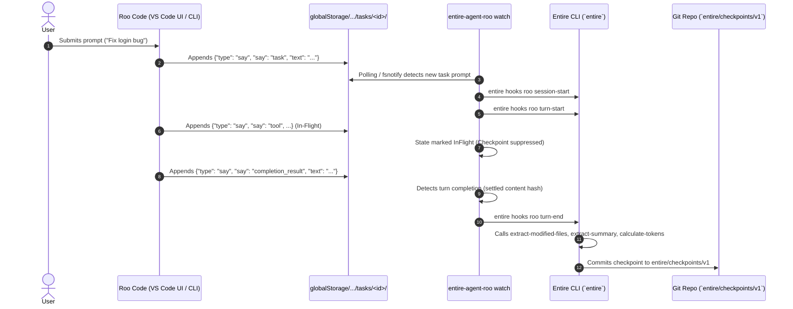
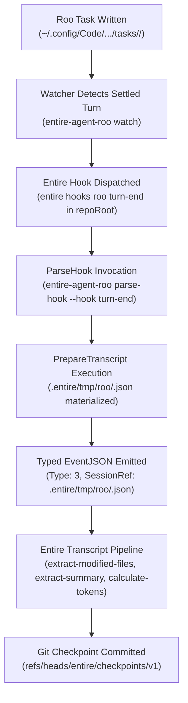

# 14 - Roo Code Adapter Specification & Watcher Architecture

> [!NOTE]
> **Purpose:** Technical specification and architecture documentation for `entire-agent-roo`, detailing the storage-driven watcher sidecar and Entire protocol bridge.

---

## 1. System Architecture: Storage-Driven Watcher

Because Roo Code has no native command-hook dispatcher in its extension host, `entire-agent-roo watch` acts as an external storage-driven observer that triggers Entire's lifecycle:



---

## 2. Directory Structure in Monorepo

```
agents/entire-agent-roo/
├── AGENT.md                                 # Full agent spec & protocol mapping
├── README.md                                # Setup & subcommand reference
├── go.mod                                   # Go 1.26 module
├── mise.toml                                # Task runner configs (test, build)
├── cmd/
│   └── entire-agent-roo/
│       └── main.go                          # CLI dispatch entrypoint (including 'watch')
└── internal/
    ├── protocol/                            # Entire Protocol v1 Layer
    │   ├── types.go                         # DeclaredCapabilities, EventJSON, HookInputJSON
    │   ├── protocol.go                      # Handlers & I/O
    │   └── handlers_test.go                 # Protocol handler unit tests
    └── roo/                                 # Roo Code Domain Logic
        ├── types.go                         # ClineMessage, ApiMessage, RooTaskEnvelope
        ├── paths.go                         # Task directory discovery & safe IDs
        ├── paths_test.go                    # Path resolution tests
        ├── agent.go                         # Info, Detect, Resume formatting
        ├── hooks.go                         # ParseHook implementation
        ├── hooks_test.go                    # Hook parsing tests
        ├── transcript.go                    # Modified files, summary, tokens extraction
        ├── transcript_test.go               # Transcript processing unit tests
        ├── watcher.go                       # Storage watcher daemon & state machine
        └── watcher_test.go                  # Watcher state machine unit tests
```

---

## 3. Lifecycle State Machine & Classification

The watcher evaluates the tail of `ui_messages.json` and `api_conversation_history.json`:

```go
func IsTurnCompleted(uiMessages []ClineMessage, apiHistory []ApiMessage) bool {
    if len(uiMessages) == 0 {
        return false
    }
    lastUI := uiMessages[len(uiMessages)-1]

    // 1. Streaming message is in-flight
    if lastUI.Partial {
        return false
    }

    // 2. Intermediate tool execution is in-flight
    if lastUI.Say == "api_req_started" || lastUI.Say == "tool" || lastUI.Say == "command" {
        return false
    }

    // 3. User permission modal is paused
    if lastUI.Type == "ask" && (lastUI.Ask == "tool" || lastUI.Ask == "command") {
        return false
    }

    // 4. Completed response states
    if lastUI.Say == "text" || lastUI.Say == "completion_result" || lastUI.Ask == "followup" {
        if len(apiHistory) > 0 {
            return apiHistory[len(apiHistory)-1].Role == "assistant"
        }
        return true
    }
    return false
}
```

---

## 4. Lifecycle Mechanics & Protocol Verification

1. **Protocol Integration**:
   * `entire hooks roo <verb>` invokes `entire-agent-roo parse-hook --hook <verb>`.
   * `parse-hook` returns typed `EventJSON` (1=SessionStart, 2=TurnStart, 3=TurnEnd, 5=SessionEnd).
2. **Deduplication**:
   * SHA-256 content signatures of `ui_messages.json` prevent repeated OS file modifications from firing duplicate checkpoints.
3. **Atomic Safety**:
   * Reads from `ui_messages.json` and `api_conversation_history.json` catch JSON parse errors during in-flight writes and retry on the next tick once the file write has settled.

---

## 5. Comprehensive Integration Audit Findings

An integration audit of `agents/entire-agent-roo` and `watcher.go` reveals key lifecycle, protocol, and runtime considerations:

### A. Entire CLI Command Syntax & Capabilities Gating
* **Syntax Verified**: The watcher invokes `entire hooks roo <hook-name>` with JSON on stdin. The standard verbs are `session-start`, `turn-start`, `turn-end`, and `session-end`.
* **Capability Gating**: In `internal/roo/agent.go`, `Capabilities.Hooks` is currently set to `false`. In Entire CLI, running `entire hooks <agent>` verifies that the target adapter advertises `Capabilities.Hooks = true`. If `false`, Entire CLI skips or rejects hook execution.
* **`ParseHook` Bridge**: Currently, `internal/roo/hooks.go` returns `nil, nil` for all hooks. For `entire hooks roo <verb>` to trigger Entire's checkpoint machinery on `turn-end`, `ParseHook` must parse the payload emitted by the watcher and return a populated `protocol.EventJSON` (`Type: 1` for session-start, `Type: 2` for turn-start, `Type: 3` for turn-end, `Type: 5` for session-end).

### B. Workspace & Directory Resolution Bug in Emitter
* In `watcher.go` (`NewWatcher`), `DefaultHookEmitter.RepoRoot` defaults to `GetGlobalStorageTasksDir()`.
* **Impact**: Entire CLI expects commands to be executed within the target Git repository workspace (where `.git/` and `.entire/` reside). Executing `entire hooks roo` inside VS Code's `globalStorage` directory fails because it is not a Git repository.
* **Fix Required**: The emitter must resolve the repository root (e.g., from `ENTIRE_REPO_ROOT`, workspace folder heuristics, or task metadata) rather than running in `globalStorage`.

### C. State Machine & Event Classification Analysis
1. **`ask: "followup"` vs User Prompts**:
   * `DetectNewPrompt` currently checks `(msg.Type == "ask" && msg.Ask == "followup")`. In Roo Code, this is an assistant inquiry to the user. Treating it as a new user prompt prematurely starts a turn.
   * Conversely, `IsTurnCompleted` correctly recognizes `lastUI.Ask == "followup"` as turn completion (assistant finished asking and is now waiting for user input).
2. **Concurrency in `ProcessTask`**:
   * `w.mu.Lock()` is acquired only when reading/inserting `w.states[taskID]`, but mutations on `state` occur outside the lock.
3. **Watcher Restart & Historical Task Replay**:
   * `states` is currently in-memory. If the watcher restarts, all existing tasks in `globalStorage` are re-evaluated from turn index `-1`, firing spurious `session-start`, `turn-start`, and `turn-end` events for completed past sessions.
   * State must be persisted to `.entire/tmp/roo-watcher-state.json` or initialized to ignore historical completed tasks on startup.
4. **File Write Settlement (JSON Parsing During Writes)**:
   * Roo writes `ui_messages.json` non-atomically via Node `fs.writeFile`.
   * When reading mid-write, `json.Unmarshal` returns a parse error. The watcher safely skips the tick (`continue`) and retries on the next poll (250ms), preventing corrupted state.

---

## 6. End-to-End Verified Lifecycle Chain



1. **Roo task** $\rightarrow$ Roo Code appends turn messages to `ui_messages.json`.
2. **Correct repository** $\rightarrow$ Watcher is bound to target Git repository (`--repo-root` / `ENTIRE_REPO_ROOT`).
3. **Watcher** $\rightarrow$ Evaluates state machine with mutex safety; confirms settled turn signature.
4. **Entire hook** $\rightarrow$ Fires `entire hooks roo turn-end` in the Git repo directory with JSON stdin.
5. **ParseHook & EventJSON** $\rightarrow$ Parses payload and maps to `protocol.EventJSON` (`Type: 3`).
6. **SessionRef & Prepared Transcript** $\rightarrow$ `PrepareTranscript` packages `RooTaskEnvelope` into `.entire/tmp/roo/<sessionID>.json` before returning.
7. **TurnEnd & Checkpoint** $\rightarrow$ Entire CLI runs transcript analyzers against `SessionRef` and writes the Git checkpoint.

---

## Related Notes
* [[00 - Project Overview]] — Executive summary of ContextForge / Entire adapter.
* [[04 - Architecture]] — Complete architecture diagrams.
* [[06 - External Agent Integration]] — Wire protocol specification.
* [[13 - Technical Research]] — Candidate evaluation and research findings.


