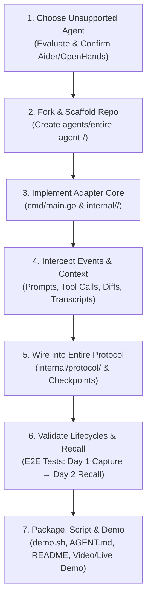

# Buildathon — What We Actually Need To Do

> [!IMPORTANT]
> **Operational Blueprint:** This document outlines the exact, step-by-step technical plan for the 3-person team to execute from start to submission during the hackathon.

---

## 1. End-to-End Execution Flow



---

## 2. The 7-Step Implementation Blueprint

### Step 1: Finalize the Unsupported AI Coding Agent
* **Action**: Confirm our target is an AI coding tool not yet present in `entireio/external-agents/agents/` (e.g., **Aider**).
* **Validation**:
  ```bash
  # Check existing agents
  ls entireio/external-agents/agents/
  # Ensure target has accessible CLI or event streams
  aider --version
  ```

---

### Step 2: Create Integration Scaffold inside `entireio/external-agents`
* **Action**: Create the designated directory structure for the new adapter inside our fork:
  ```bash
  mkdir -p agents/entire-agent-<target>/cmd/entire-agent-<target>
  mkdir -p agents/entire-agent-<target>/internal/<target>
  mkdir -p agents/entire-agent-<target>/internal/protocol
  mkdir -p agents/entire-agent-<target>/tests/unit
  mkdir -p agents/entire-agent-<target>/tests/e2e
  mkdir -p agents/entire-agent-<target>/scripts
  ```
* **Files Initialized**:
  * `agents/entire-agent-<target>/go.mod`
  * `agents/entire-agent-<target>/mise.toml`
  * `agents/entire-agent-<target>/AGENT.md`
  * `agents/entire-agent-<target>/README.md`

---

### Step 3: Implement the Adapter Core (Person 1 Lead)
* **Action**: In `cmd/entire-agent-<target>/main.go` and `internal/<target>/agent.go`, create the process supervisor:
  * Parse CLI flags (`--session-id`, `--working-dir`, `--entire-socket`).
  * Initialize the subprocess runner to spawn and manage the target agent.
  * Connect pipes to the agent's `stdin`, `stdout`, and `stderr`.

---

### Step 4: Capture Agent Activity & Context (Person 1 & 2)
* **Action**: In `internal/<target>/hooks.go` and `internal/<target>/transcript.go`:
  * **Prompts**: Intercept user input on submission.
  * **Tool Calls**: Match tool execution patterns (e.g. `read_file`, bash command lines, test runners).
  * **Responses**: Stream LLM reasoning and explanation chunks.
  * **File Modifications**: Detect filesystem writes or git status changes.
  * **Transcripts**: Assemble parsed turns into typed Entire `Transcript` structures.

---

### Step 5: Connect to Entire Protocol & Checkpointing (Person 2 Lead)
* **Action**: In `internal/protocol/protocol.go`:
  * Emit `SESSION_START` upon agent launch.
  * Send incremental `TURN_START` and `TURN_FINISH` events as user-agent interactions progress.
  * Trigger `CHECKPOINT_CREATE` linked to the Git commit SHA when changes are committed.
  * Emit `SESSION_END` on shutdown.
  * Validate that Entire CLI registers checkpoints under `refs/entire/`.

---

### Step 6: Test Checkpoints & Cross-Session Context Recall (Person 2 & 3)
* **Action**: Validate the complete lifecycle across two distinct sessions:
  1. **Session 1 Test**:
     * Run task $\rightarrow$ Verify files modified $\rightarrow$ Verify checkpoint created $\rightarrow$ Verify `entire explain HEAD` returns full rationale.
  2. **Session 2 Test ("Agent Remembers")**:
     * Launch new session with prompt: `"Continue previous task"` $\rightarrow$ Verify adapter retrieves checkpoint context $\rightarrow$ Verify agent references Session 1 architecture.
  3. Author unit and integration tests in `tests/`.

---

### Step 7: Build Demo Flow, Documentation & Presentation (Person 3 Lead)
* **Action**:
  * Create `scripts/demo.sh` to run the deterministic demo end-to-end.
  * Write `README.md` and `AGENT.md` with complete architecture diagrams and usage instructions.
  * Verify `mise run build` and `mise run test` pass cleanly.
  * Rehearse the 3-minute before-and-after presentation pitch.

---

## 3. Hour-by-Hour Timeline for the Team

```mermaid
gantt
    title Hackathon Execution Timeline
    dateFormat HH:mm
    axisFormat %H:%M

    section Phase 1: Alignment
    Shared architecture analysis & target validation :00:00, 01:30

    section Phase 2: Core Build
    Person 1 - Adapter & hooks.go implementation      :01:30, 04:30
    Person 2 - Protocol encoding & checkpoint tests   :01:30, 04:30
    Person 3 - mise.toml, test harness & docs         :01:30, 04:30

    section Phase 3: Integration
    Merge feature branches into main fork             :04:30, 05:30
    Validate Day 1 capture & Day 2 recall             :05:30, 07:00

    section Phase 4: Polish & Pitch
    Build demo.sh, presentation slides, rehearse      :07:00, 08:30
    Final submission PR & demo recording              :08:30, 09:00
```



---

## 4. Immediate Next Actions

1. [ ] **Fork `entireio/external-agents`** to your team's GitHub organization.
2. [ ] **Clone locally** and verify you can build an existing agent (`mise run build`).
3. [ ] **Run a 15-minute spike** capturing CLI output from the target agent.
4. [ ] **Create feature branches**: `integration`, `protocol-context`, `demo-docs`.
5. [ ] **Start Phase 1 scaffold** in `agents/entire-agent-<target>/`.

---

## Related Notes
* [[00 - Project Overview]] — Vision and summary.
* [[03 - What We Have To Build]] — Deliverables definition.
* [[04 - Architecture]] — End-to-end architecture.
* [[07 - Repository Structure]] — Monorepo layout.
* [[08 - Development Workflow]] — Phased workflow.
* [[09 - Team Responsibilities]] — Work division.
* [[10 - MVP]] — MVP acceptance criteria.
* [[11 - Demo Flow]] — Step-by-step presentation script.
